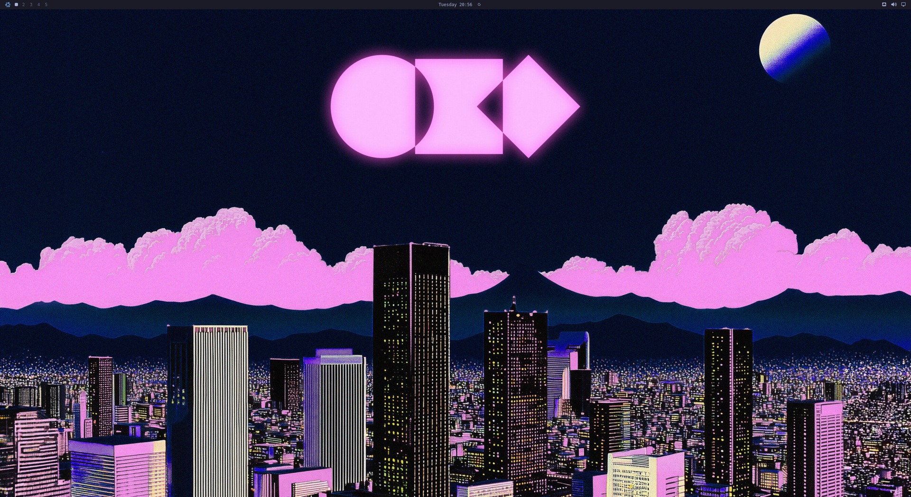
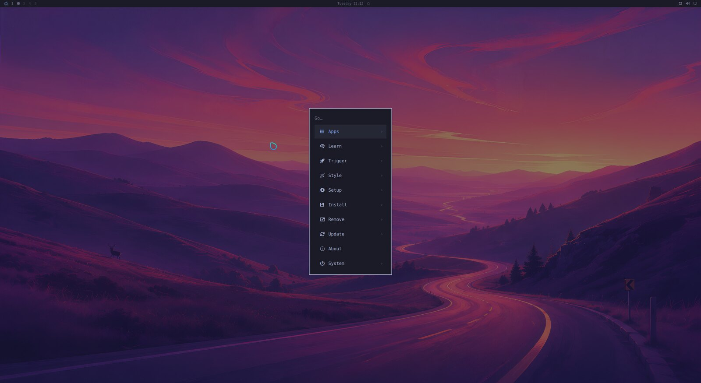
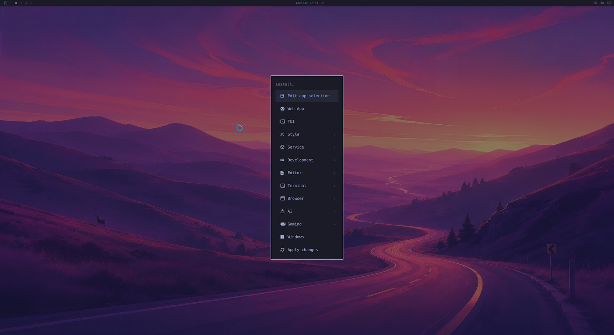
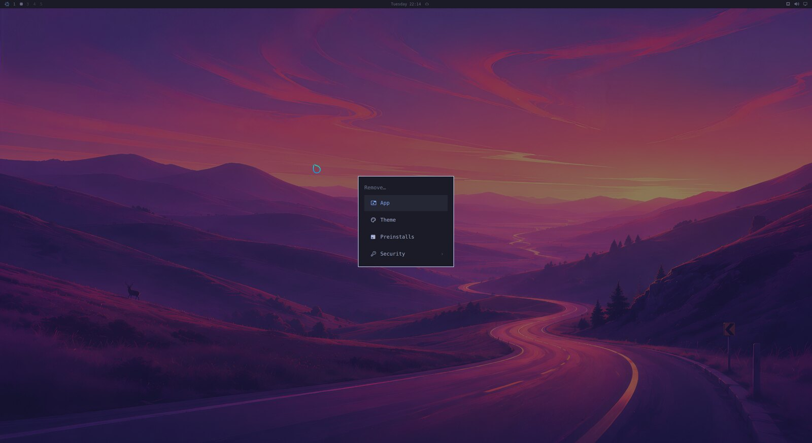
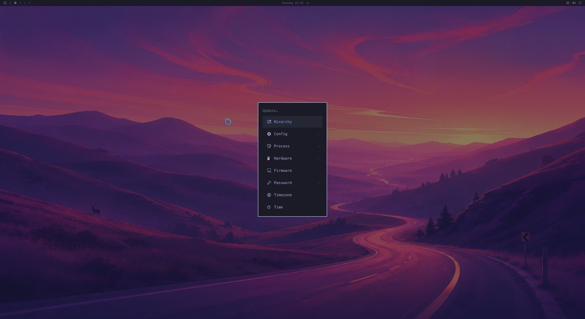
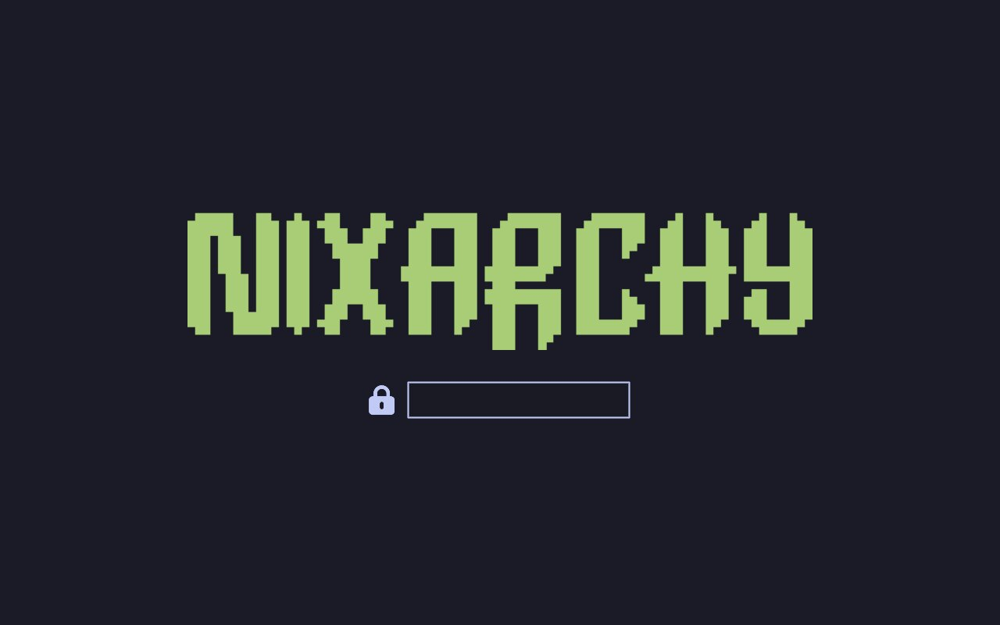
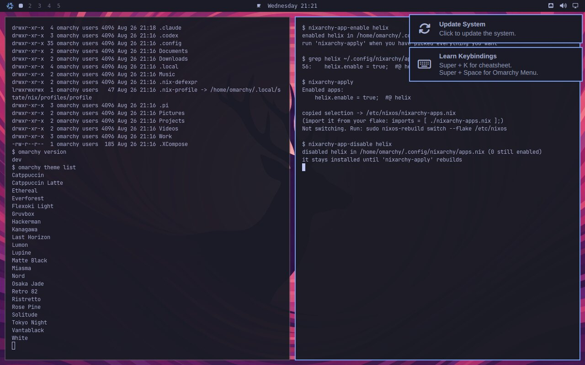
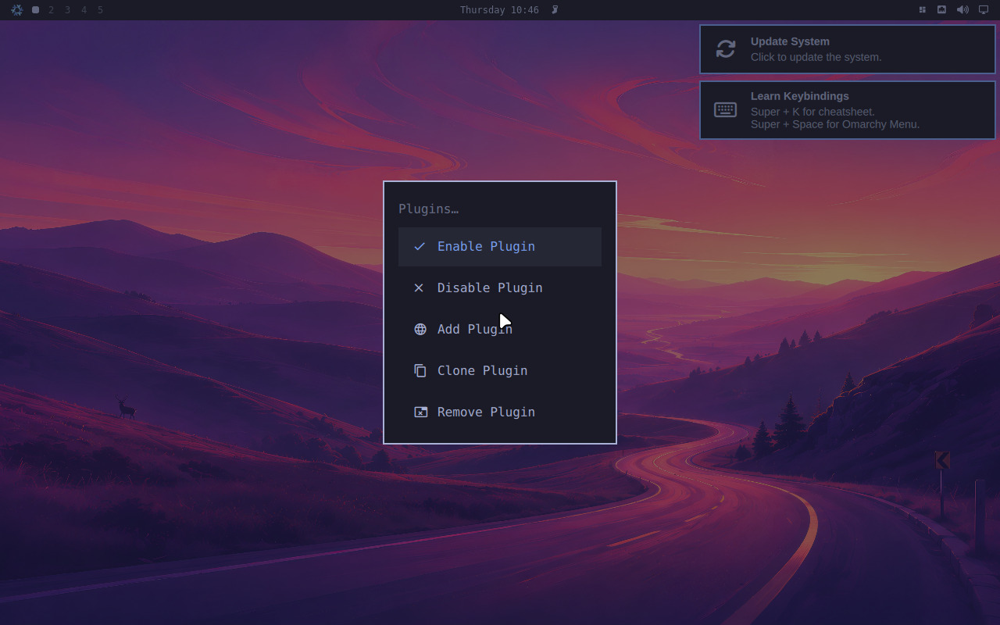
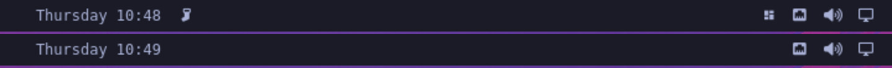

# nixarchy

[Omarchy](https://omarchy.org) vendored for NixOS — the whole desktop, with its
menus rewired to Nix instead of pacman.

Omarchy 4.x is not a dotfiles repo, it's an application: **438 shell commands**,
a QuickShell desktop shell, 22 themes, and Hyprland configured through the Lua
API introduced in 0.55. Nixarchy packages that tree as a derivation and replaces
the parts that assume Arch, rather than reimplementing it in Nix.

Tracking an upstream release is a source bump, not a re-port.


*Login through the branded greeter, the Omarchy menu, four themes, and an app
selected and applied — captured from a real VM by `nix build .#demo`.*



| the menu | Install |
|---|---|
|  |  |
| **Remove** | **Update** |
|  |  |
|  |  |

More in [`docs/screenshots/`](docs/screenshots).

## What works

| | |
|---|---|
| Hyprland session, QuickShell bar, 22 themes | as upstream ships them |
| `omarchy` CLI | all 427 subcommands, `omarchy commands --check` green |
| **Install menu** | picks write to a Nix config, not pacman |
| **Remove menu** | deselects apps, never touches your own config |
| **Update menu** | `nix flake update` + `nixos-rebuild switch --flake` |
| 39 apps in the selection | 28 from nixpkgs, 5 as NixOS modules, 4 built here, 2 with no equivalent |
| Learn menu | NixOS wiki, `search.nixos.org` packages and options |
| Shell functions | bash and zsh source the chain; fish derives it from the same files |
| RetroArch | 13 libretro cores, resolved from the store rather than `/usr/lib` |
| **Plugins** | `omarchy plugin add <url>` works as upstream ships it, and `programs.nixarchy.plugins` pins one in your flake |

## Why vendoring

Everything upstream resolves through a single environment variable:

```lua
-- default/hypr/bootstrap.lua
package.path = home.."/.local/state/?.lua;"..home.."/.config/?.lua;"
  ..(os.getenv("OMARCHY_PATH") or "/usr/share/omarchy").."/?.lua;"
```

Point `OMARCHY_PATH` at a store path and the bins, the QML shell, the themes and
the Lua defaults all follow. Only **24 of 431 scripts** actually run
`pacman`/`yay` — that's the entire distro-coupling surface.

Ten of those are replaced outright, in `pkgs/omarchy/nix-bin/`: the ones the
menus drive. The rest manage Arch release channels, keyrings and orphan
pruning, none of which have a Nix meaning worth reimplementing — your flake
input *is* the release channel, and the store has no orphans. Those fail either
way, so a `pacman` shim only changes *how*: instead of `command not found`, you
get told what replaced the command. It keeps pacman's contract (stderr,
non-zero), so `omarchy version` and `omarchy debug`, which already wrap it in
`2>/dev/null || fallback`, are unaffected.

## Installing apps

Omarchy's Install menu runs `pacman -S`. Here it edits a file you own.

Every app Omarchy offers is written to `~/.config/nixarchy/apps.nix` at first
login, fully populated and **entirely commented out**:

```nix
{
  programs.nixarchy.apps = {
    # ── Browser ───────────────────────────
    # brave.enable      = true;  #@ brave
    # firefox.enable    = true;  #@ firefox    # a NixOS module, so policies are declarative too
    # ── Service ───────────────────────────
    # tailscale.enable  = true;  #@ tailscale  # a daemon
    # _1password.enable = true;  #@ _1password # unfree — needs the module for its setuid helper
  };
}
```

Picking an app from the menu uncomments one line and tells you so. Pick as many
as you like — **nothing is built until you apply**, which is the point of a
declarative system:

```
Install ▸ Brave          →  "brave queued — not installed yet"
Install ▸ VSCode         →  "2 app(s) selected"
Install ▸ Apply changes  →  nixos-rebuild switch --flake
```

The notification is clickable and runs the rebuild.

### Why it isn't a package list

Several of these are **not packages** on NixOS, and a flat `systemPackages`
list would have been quietly wrong:

| app | what it actually needs |
|---|---|
| Steam | `programs.steam` — an FHS wrapper, or it will not run |
| 1Password | `programs._1password-gui` — a setuid helper, or it cannot unlock |
| Tailscale | `services.tailscale` — a daemon |
| Xbox controllers | `hardware.xpadneo` — a kernel driver |
| Firefox | `programs.firefox` — so policies and extensions stay declarative |

`data/apps.nix` records which is which, and per-app `settings` merge at that
app's own option path:

```nix
programs.nixarchy.apps.tailscale = {
  enable = true;
  settings.useRoutingFeatures = "client";   # → services.tailscale.useRoutingFeatures
};
```

## Usage

```nix
{
  inputs.nixarchy.url = "github:olafkfreund/nixarchy";

  outputs = { nixpkgs, nixarchy, ... }: {
    nixosConfigurations.mymachine = nixpkgs.lib.nixosSystem {
      modules = [
        nixarchy.nixosModules.nixarchy
        {
          programs.nixarchy.enable = true;
          # Where nixarchy-apply copies your app selection before rebuilding.
          programs.nixarchy.flake = "/home/you/nixos-config";
        }
        ./nixarchy-apps.nix # the generated selection
      ];
    };
  };
}
```

And in Home Manager:

```nix
{
  imports = [ nixarchy.homeManagerModules.nixarchy ];
  programs.nixarchy.enable = true;
  programs.nixarchy.defaultTheme = "tokyo-night";
}
```

### Shell functions

Omarchy's [shell functions](https://omarchy.org/manual/shell-functions/) —
`compress`, `dip`, `hdl`, `tdl`, `iso2sd`, the tmux and git-worktree helpers,
20 in all — come from a bash rc chain that also sets aliases and `EDITOR`. It
needs no patching here: every path in it resolves through `OMARCHY_PATH`.

It is on by default, and opinionated: it aliases `ls` to eza, `cd` to zoxide
and `g` to git. Turn it off if you bring your own shell config:

```nix
programs.nixarchy.bashIntegration = false;
```

Left on, it loads from `/etc/bashrc` — *before* `~/.bashrc` — so anything you
define yourself still wins. Nothing in the desktop depends on it: the menus
call the `omarchy-*` executables directly, not these functions.

### Plugins

[Omarchy's plugin system](https://omarchy.org/manual/plugins/) works here
unchanged — the menu below is upstream's own, running on NixOS:



Two published third-party plugins, installed into that session and then turned
off again. The top bar is the same bar in both strips — the teleprompter glyph
beside the clock and the widget-toggle icon on the right are
[omteleprompt](https://github.com/seyhunak/omteleprompt) and
[omarchy-bar-toggle](https://github.com/r3mcos3/omarchy-bar-toggle):



Both frames come out of `checks.plugin`, which installs those two plugins from
their real repositories on every push and fails if the shell does not load
them. Adding one is a command, not a rebuild:

```bash
omarchy plugin add https://github.com/seyhunak/omteleprompt.git --enable
```

Or from the menu above, which is where most people will find it. Add opens a
floating terminal and asks for the URL. Those rows are upstream's own — nixarchy
adds none and, more to the point, takes none away: the menu you see is Omarchy's default with the
nixarchy extension merged over it by id, and that extension rewrites only the
`install.*` and `remove.*` rows. The check asserts it never names a
`setup.plugin.*` id, because an override that did would hide the row with no
error anywhere.

That clones into `~/.config/omarchy/plugins/` at runtime and the running shell
picks it up — no rebuild, no flake edit, nothing added to `apps.nix`. It is
upstream's design and nixarchy keeps it: a plugin is somebody's QML loaded into
your bar, and pinning that in a flake would make trying one a five-minute
round trip instead of a command.

Two things make it work on NixOS that would otherwise be quiet failures, and
both are covered by `nix build .#checks.x86_64-linux.plugin`, which installs two
real published plugins and then removes them again:

- **`~/.config/omarchy` is a real directory, not a store symlink.** Home Manager's
  usual answer for a config file is a read-only link into `/nix/store`. The seed
  uses `cp -rn` instead, so `plugin add` can write there at all.
- **A plugin gets whatever `pkgs/omarchy/default.nix` declares, and nothing else.**
  Plugins shell out to commands they assume are present — omteleprompt's voice
  mode runs `python3`, `parecord` and `arecord`. On Arch those are just there.
  Here they are on the list, and the check keeps them there. A plugin needing
  something that isn't will fail silently inside a QML `Process`, so if one
  misbehaves, that is the first thing to look at.

#### Declaring plugins in your configuration

Plugins can also be pinned, so a machine rebuilt from your flake comes up with
them already there:

```nix
programs.nixarchy.plugins.omteleprompt.src = pkgs.fetchgit {
  url = "https://github.com/seyhunak/omteleprompt.git";
  rev = "9a35865220a0c9d65132329e446a84c466545110";
  hash = "sha256-KJM/AC1DnPwob40lo39Rlk9qkyKTI++bss1wPIcGsTs=";
};
```

`src` is any directory with a `manifest.json` at its root — a `fetchgit`, a
flake input, or a path in your own repo while you write one.

This works because upstream already separates the two halves: a plugin's *code*
lives in `~/.config/omarchy/plugins/<id>/`, while whether it is enabled and
where it sits in the bar are recorded in `~/.config/omarchy/shell.json` by the
running shell. So the code can come from the store — the directory is a symlink,
which upstream's scan follows and `omarchy plugin remove` has an explicit branch
for — without freezing anything the user changes at runtime.

Three consequences worth knowing, all of them deliberate:

- **It installs a plugin; it does not enable one.** Enable it once from
  Setup → Plugins and that choice sticks, because it is recorded in
  `shell.json` rather than in the plugin folder. Managing enablement from Nix
  would mean a plugin you turned off came back at the next rebuild.
- **The id comes from the plugin's own `manifest.json`**, not from the
  attribute name. It is what the shell, the menu and every `omarchy-plugin-*`
  command key on, so a folder named anything else would be a plugin you could
  not enable or remove by the name on screen.
- **A broken manifest fails the rebuild**, checked with upstream's own
  `omarchy-plugin-validate` rather than a copy of its rules — so it cannot
  drift at the next Omarchy bump. You find out at `nixos-rebuild` instead of
  after logging in to a plugin that installed and does nothing.

`omarchy plugin add` still works alongside this, and the two do not collide: a
plugin you add by hand is a real directory this never touches, and adding one
whose id you already declare is refused rather than installed twice.

Plugins run unsandboxed inside your long-lived shell process. Upstream warns
about this at the prompt and refuses `ext::`-style URLs that would run a command
at clone time; both behaviours are intact here.

### RetroArch cores

`pkgs.retroarch` is `retroarch-with-cores` built with an **empty** core list,
so installing it plainly gives an emulator that can run nothing.
`programs.nixarchy.apps.retroarch` therefore ships its own build with 13 cores
— every core Omarchy's own picker offers that nixpkgs carries under a free
licence, with bsnes and blastem standing in for the unfree snes9x and
genesis-plus-gx.

`retroarch-full` would be the obvious alternative and is the wrong one: it
pulls unfree cores, and a single unfree package in the app list aborts the
whole rebuild rather than failing on its own. To widen the set, set
`nixpkgs.config.allowUnfree` and override the package:

```nix
programs.nixarchy.apps.retroarch = {
  enable = true;
  package = pkgs.retroarch.withCores (c: [ c.snes9x c.mame c.dolphin ]);
};
```

Whatever you pick shows up in the menu picker: upstream filtered the core
directory against 22 hardcoded names, which would have hidden anything you
added, so nixarchy lists what is actually installed and takes the labels from
`libretro-core-info`.

## Binary cache

Enabling nixarchy otherwise means compiling a compositor, because it pins
Hyprland ahead of nixpkgs. The module adds both caches for you:

```
https://nixarchy.cachix.org   the vendored tree, this flake's own packages,
                              and Hyprland at whatever commit is pinned
https://hyprland.cachix.org   hyprwm's own builds
```

`programs.nixarchy.binaryCaches = false` if you would rather trust neither and
build from source. This is the one setting worth a deliberate decision:
substituters are a list, so they merge into whatever you already trust without
any conflict to warn you.

## Adding it to a machine you already run

Start here:

```sh
nix run github:olafkfreund/nixarchy#doctor
```

It reads the running system and prints the configuration that machine needs --
before nixarchy is an input anywhere. It changes nothing.

Then, in order:

1. **Add the input**, and import the NixOS module.

   ```nix
   inputs.nixarchy.url = "github:olafkfreund/nixarchy";
   # in your host's modules:
   imports = [ inputs.nixarchy.nixosModules.nixarchy ];
   programs.nixarchy.enable = true;
   ```

2. **Paste what the doctor printed.** On a machine that already runs Hyprland
   behind greetd, that is:

   ```nix
   programs.nixarchy.displayManager = false;                        # keep your greeter
   programs.hyprland.package = lib.mkForce pkgs.hyprland;           # keep your Hyprland
   programs.hyprland.portalPackage = lib.mkForce pkgs.xdg-desktop-portal-hyprland;
   ```

3. **Import the Home Manager module** for the user who will run the desktop.
   Without it there is no app selection, no theme state and no seeded config.

   ```nix
   home-manager.users.you = {
     imports = [ inputs.nixarchy.homeManagerModules.nixarchy ];
     programs.nixarchy.enable = true;
   };
   ```

4. **Rebuild.** `nixos-rebuild switch` will tell you about anything the doctor
   missed: every remaining conflict is an evaluation failure, not a broken
   machine.

5. **Log out and pick "Omarchy"** at your greeter. If you already have a
   Hyprland config, this is the step that matters -- see below.

### After it is installed

```sh
nix run github:olafkfreund/nixarchy#verify
```

From inside a running Omarchy session. Everything this repo checks in CI runs
in a machine with no GPU, no Bluetooth radio, no network and no sound -- which
catches a great deal and cannot answer whether the compositor got hardware
acceleration, whether bluetoothd sees an adapter, or whether the RetroArch
cores landed where RetroArch looks. This asks those, and prints what it found
rather than a verdict: `llvmpipe` and `AMD Radeon` are both a pass to a script
and mean opposite things to a person.

### If you already have a `~/.config/hypr/hyprland.lua`

Nixarchy never overwrites a file you own, so Omarchy's own `hyprland.lua` is
not installed and nothing in `~/.config/hypr` starts its bar or binds its keys.

The **Omarchy** session is the answer, and it is registered by default. It runs
Hyprland against Omarchy's own config with `--config`, so it needs no file of
yours: your session stays yours, and Omarchy's is Omarchy's. `nix build
.#checks.x86_64-linux.coexist` boots exactly that arrangement -- a foreign
`hyprland.lua` in place, the Omarchy session launched from its own `.desktop`,
and the desktop asserted to render.

The two sessions share
`~/.config/hypr/{monitors,input,bindings,looknfeel,autostart}.lua`, because
Omarchy's bootstrap builds Hyprland's Lua module path from `$HOME/.config` and
nothing else. Only the entry point differs, so editing those changes both.

### What defers to you automatically

Every system service the module turns on is `mkDefault`, so your own settings
win rather than colliding. If you already run Docker your way, or
systemd-networkd instead of NetworkManager, or Plymouth off, nothing here
argues with you.

Two cases are handled rather than merely deferred:

| Your machine | What happens |
| --- | --- |
| TLP for power management | power-profiles-daemon is left off; NixOS forbids both. `omarchy powerprofiles` stops working, nothing else does |
| GDM, LightDM, greetd or ly | set `displayManager = false`; your greeter picks up the **Omarchy** entry from `wayland-sessions` and you lose only the branded greeter |
| Hyprland already configured | log in through the **Omarchy** session. It runs Hyprland against Omarchy's own `hyprland.lua` via `--config`, so it never needs `~/.config/hypr/hyprland.lua` and your session keeps working |

Two are not, because they are not nixarchy's to resolve:

- **PulseAudio.** NixOS enables PipeWire for any graphical session and asserts
  the two cannot coexist. A plain `programs.hyprland.enable = true` with
  PulseAudio fails the same way, with no nixarchy in sight.
- **Hyprland itself.** `programs.hyprland.enable`, its package and `withUWSM`
  are set outright, not with `mkDefault`. Omarchy is written against Hyprland's
  Lua API; replacing the compositor means `lib.mkForce`, which is the right
  amount of friction for that. If you already pin your own Hyprland, `mkForce`
  it -- anything from 0.55 satisfies the assertion.

The two sessions do share `~/.config/hypr/{monitors,input,bindings,looknfeel,
autostart}.lua`, because Omarchy's bootstrap builds Hyprland's Lua module path
from `$HOME/.config` and nothing else. Only the entry point differs.

## Try it in a VM

```sh
# graphical -- this is the one that shows the desktop
QEMU_OPTS="-device virtio-vga-gl -display gtk,gl=on" \
  nix run github:olafkfreund/nixarchy#vm

# headless -- serial console, for reading the journal when the session is broken
QEMU_OPTS="-display none -serial mon:stdio" \
  nix run github:olafkfreund/nixarchy#vm
```

Autologs in as `omarchy` / `omarchy`, with sshd on `localhost:2222` so the VM
can be inspected and driven from the host.

**The VM's disk is ephemeral.** `nix run .#vm` otherwise writes a
`nixarchy-vm.qcow2` and reuses it forever, which makes a smoke test replay the
previous run's state — Omarchy persists every notification under
`~/.local/state/omarchy/notifications/history/` and replays it on start, so
fixed bugs kept reappearing from a stale disk.

## Screenshots and the screencast

`nix build .#demo` boots a machine, logs in through the greeter, drives a tour
of it and writes the frames plus an mp4 and a GIF:

```sh
nix build .#demo
ls result/screenshots/          # every step, numbered
cp result/nixarchy-demo.gif docs/nixarchy-demo.gif
```

It needs no display and no SSH, because the frames come from qemu's own
screendump rather than a compositor screencopy -- `grim` cannot help here, as
nothing consumes the frames and it blocks forever.

`docs/capture-screenshots.sh` is the older path and still captures menus the
tour does not visit. It has to run against a **graphical** VM, for that same
reason:

```sh
ssh -p 2222 omarchy@localhost 'bash -s' < docs/capture-screenshots.sh
scp -P 2222 'omarchy@localhost:~/nixarchy-screenshots/*.png' /tmp/shots/
# they are photographic, so the repo keeps them as jpg
for f in /tmp/shots/*.png; do
  magick "$f" -resize 1600x -quality 86 "docs/screenshots/$(basename "${f%.png}").jpg"
done
```

## Staying current with Omarchy

Almost nothing here waits on a maintainer.

**33 of the 39 apps never touch this repo.** Brave, VSCode, Signal and the rest
are installed as `pkgs.<name>` from **your** nixpkgs, and the five
module-backed ones (Steam, 1Password, Tailscale, Firefox, Xbox controllers)
come from there too — the module is NixOS', not this repo's. Your own
`nix flake update` moves all of them. Nixarchy is not in that path, so there
is nobody to wait for.

**Omarchy itself is checked daily.** `omarchy.yml` asks GitHub for the newest
release, and if it differs from the pin it bumps the input and re-runs every
assertion against the new tree:

```
v4.0.0 -> v4.0.1
  ✓ the vendored tree builds
  ✓ every bin this port replaces is still there
  ✓ every substituteInPlace anchor still matches   (--replace-fail)
  ✓ every menu row it overrides still exists
  ✓ all 37 Install rows are still mapped in data/apps.nix
  ✓ a booted session renders its wallpaper   (delta 10, threshold 120)
```

Each line is a different way upstream can break this port, and each has caught
a real one. The last is the reason the others are not enough on their own: the
desktop once rendered pure black while every other check passed — a wallpaper
wider than `GL_MAX_TEXTURE_SIZE` draws nothing at all while Qt still reports
the image `Ready`. So the session test boots a machine, screenshots it through
qemu, and compares the screen's average colour to the wallpaper's own.

If they all pass, the bump merges itself. When one fails, the run summary
names which of them broke and which file to edit. **A new app in Omarchy's Install menu is usually one line** in
`data/apps.nix` — `attr` for a plain nixpkgs package, `option` for something
that needs a NixOS module. The menu rewiring and its Remove row are generated
from that entry.

## Keeping applications updated

Most of it is not our job, and should not be:

| where the app comes from | who updates it |
|---|---|
| nixpkgs (33 of 39 apps) | **nobody** — your own `nix flake update` |
| pinned in this repo (2) | a weekly bot, opening a PR |
| `zen` | upstream's own flake |
| `retroarch` | nixpkgs, via this flake's own pin — it is a rebuild with cores |

For the handful pinned here by version and hash, `.github/workflows/update.yml`
runs `nix run .#update` weekly, builds everything it changed, and opens a
PR. Those PRs are **not** auto-merged: a build proves a package assembles, not
that it still launches, and two of them are proprietary Electron bundles that
can do the first without the second.

Every app also exposes a `package` option, so a newer version is yours to take
without a fork or a PR:

```nix
programs.nixarchy.apps.once.package =
  nixarchy.packages.${system}.once.overrideAttrs (old: rec {
    version = "0.4.0";
    src = pkgs.fetchurl {
      url = "…";
      sha256 = "…";
    };
  });
```

## Design notes

Each of these is a bug that shipped, was found, and is now guarded by CI.

### The menu is data, and overrides destroy what they omit

Upstream reads one extension file and merges it over the defaults by id. Its
comment says you can *"tweak label/icon/action without re-declaring the whole
row"*. **The code does not do that:**

```js
label: value.label || id,                    // normalizeItem runs on the override too
icon:  value.icon  || "",
for (var k2 in entry) merged[k2] = entry[k2] // then copies ALL keys over the default
```

An override that omits a key does not inherit upstream's — it blanks it.
Omitting `label` renders the raw id (`install.editor.vscode` instead of
`VSCode`); omitting `action` makes the row do nothing when clicked. The menu
extension is therefore **generated by reading Omarchy's own menu** and carrying
every unstated key across, so labels can never drift from upstream's. CI
rejects a row with no label or no action.

The 16 per-app Remove rows are derived the same way: upstream names the app
only inside its `when`, as `omarchy-pkg-present <arch-package>`, so the
generator reads that and rewrites the row.

### Bins are symlinked, not wrapped

`bin/omarchy` discovers its subcommands by grepping the first 80 lines of each
sibling for `# omarchy:summary=`. A `wrapProgram`-generated wrapper has no such
comment, so wrapping every bin makes the CLI report **zero** commands while
still building fine. Runtime dependencies reach the scripts through the
module's `systemPackages` instead.

### Wallpapers are capped at 4096px

Omarchy ships wallpapers up to 7680px wide, and 5 of the 8 in the default theme
exceed 4096 — `GL_MAX_TEXTURE_SIZE` on llvmpipe and on plenty of integrated
GPUs. Over that limit the image cannot become a texture and **nothing is drawn,
with no error anywhere**: Qt reports the image `Ready` at its full size, the
layer surface exists at alpha 1, and the log is clean. `sourceSize` caps what
Qt decodes, which fixes it on every machine with that limit.

### GL apps need a software fallback in a VM

Three separate symptoms turned out to be one cause: kitty and LocalSend died
on startup with `EGL: No EGLConfigs returned`, and opening the menu blanked
the whole desktop, bar included. The scrim was not at fault — dropping its
alpha from 0.5 to 0.12 changed the rendered pixel not at all.

qemu's virgl path hands out no usable EGL config, so every GL consumer fails:
the apps refuse to start, and Hyprland composites nothing beneath its overlay
layer. The guest has `swrast`, `virtio_gpu` and a render node all the same, so
nothing looks wrong until something asks for a config.

`LIBGL_ALWAYS_SOFTWARE=1` in the VM fixes all three. With it, the menu dims
the wallpaper (`#281640` over `#36115A`) instead of erasing it. It is set for
the VM only: on a real GPU it would push every GL app onto the CPU.

### User state stays mutable

`omarchy-theme-set` applies themes at runtime by copying files into
`~/.local/state/omarchy/current/` and flipping symlinks. That's anti-Nix, and
it's also why theme switching is instant instead of a rebuild.

- **Nix owns** packages, services, hardware, `OMARCHY_PATH`, the default theme
- **Omarchy owns** `~/.local/state/omarchy` and `~/.config/omarchy` at runtime

Those are copied with `--no-preserve=mode`: `$OMARCHY_THEMES_PATH` is a store
path, so `cp -r` otherwise stages a read-only directory and the *next* theme
switch cannot clean it up.

### Hyprland comes from upstream, not nixpkgs

Omarchy 4.x needs ≥ 0.55 for `hl.bind` / `hl.window_rule` / `hl.on`; nixpkgs is
on 0.54.3.

The flake pins a **commit**, not the `v0.56.2` tag, because that tag does not
build against its own `flake.lock`: its `CMakeLists.txt` asks for
`find_package(glaze 7...<8)` while `nix/overlays.nix` feeds it the glaze 8.0.0
from its locked nixpkgs. `find_package` fails, CMake falls back to cloning glaze
over the network, and the build sandbox has none.

`inputs.nixpkgs.follows` is deliberately **not** set on it — hyprwm asks
consumers not to, and overriding forfeits their binary cache.

## Development

```sh
nix develop                  # or `direnv allow`
nix build .#omarchy          # fast -- just the vendored tree
nix flake check              # everything, including a booted session test
nix run .#vm                 # smoke test
nix run .#update         # bump the pinned packages
```

`checks.session` boots a machine, picks two apps through `nixarchy-app-enable`,
checks the file still parses, checks a repeated pick is a no-op, and checks
`nixarchy-apply` copies the selection into the flake.

## Status

Working, and each line names what proves it rather than asserting it. Every
one of these runs in CI on each push.

| | proven by |
| --- | --- |
| The session, bar, themes and wallpaper | `checks.session` logs in through SDDM's greeter and asserts the desktop *renders* -- it compares the screen against the wallpaper, because every other check passed once while it was black |
| Adding it to a machine you already run | `checks.integration` **builds** the module onto a config that overrides a package Omarchy also uses, pins its own Hyprland and already greets with greetd |
| Sitting beside an existing Hyprland | `checks.coexist` boots the Omarchy session with a foreign `hyprland.lua` in place and asserts the bar comes up anyway |
| The CLI | `omarchy commands --check`, plus a count the build refuses to let drift |
| The Install/Remove/Update menus | `checks.session` enables an app, applies it, and asserts the selection reached the flake |
| Third-party plugins | `checks.plugin` runs `omarchy plugin add <url> --enable` for two published plugins, then asks the *running shell* whether it loaded them -- not the filesystem -- before disabling and removing both |
| Plugins pinned in your configuration | `checks.plugin` installs one through `programs.nixarchy.plugins` as a store symlink and asserts the *shell* discovers and loads it, that `plugin add` refuses to double-install it, and that `plugin remove` unlinks it |
| The shell chain in bash, zsh and fish | asserted by running each shell and calling the functions, not by checking a file exists |
| Compose keys, Bluetooth, UPower, the browser accent | asserted on the thing itself: the include resolves, the unit is enabled, the portal answers, the colour is the theme's |

The integration check exists because everything else starts from a clean
machine. Three bugs shipped that only appear when the module is *built* onto a
config that already exists -- a desktop file colliding with a real package, two
nixpkgs instances, and runtime dependencies listed in two profiles at once.
None of them is an evaluation error, so none of them was caught by anything
that only evaluates.

### What is left

Nothing on the list below is waiting on a decision -- each is either
impossible, or a tradeoff taken deliberately. In rough order of how much
someone would miss it:

1. **Upstream is pinned to one Omarchy release.** The drift guards are built
   for a bump -- `--replace-fail` on every patched line, a menu cross-check, an
   icon check, an app-count check -- but no one has actually taken one yet.
   That is the next real piece of work.
2. **fish's `ga` and `gd`** cannot change your directory, and never will: they
   run as upstream's bash behind a wrapper.
3. **Battle.net and GeForce NOW** need a hand each, named in their rows. The
   wine prefixes and Flatpaks behind them are not this repo's to own.

Known gaps in detail:

- `brave-origin` has no published source; use `apps.brave` with policies in
  `/etc/brave/policies/managed`
- RetroArch's default core set is free-licensed only, so snes9x, genesis-plus-gx,
  mame and dolphin need `allowUnfree` and a `withCores` override
- in fish, `ga` and `gd` report where they went but leave you where you were.
  Every Omarchy function runs as upstream's bash behind a fish wrapper, and a
  wrapper cannot change its caller's directory. The other shells are unaffected
- Install rows that name an Arch package tell you the nixpkgs name and the
  option to put it in, rather than installing it. Fonts, the packages
  `omarchy install dev-env` adds behind a language, Ollama and the gaming
  rows' dependencies are all mapped; anything unmapped still gets the generic
  answer
- Battle.net and GeForce NOW still want a hand: the first needs
  `pkgs.umu-launcher` and `hardware.graphics.enable32Bit`, the second
  `services.flatpak.enable` and then `flatpak install flathub
  com.nvidia.geforcenow`. Their rows name both. Xbox Cloud Gaming needs
  nothing -- it is a web app, and never touches a package manager
- Plugins added with `omarchy plugin add` are runtime state: they clone into
  `~/.config/omarchy/plugins` and a machine rebuilt from the same flake comes
  up without them. That is upstream's design and worth keeping, since pinning
  every plugin would turn *trying* one into a rebuild. Pin the ones you want to
  keep with `programs.nixarchy.plugins`; whether a plugin is *enabled* stays
  runtime state either way, deliberately
- Chromium's theme *accent* needs `programs.nixarchy.browserThemeUser`, which
  hands that user the browsers' policy directories. Chromium reads policy only
  from `/etc`, with no per-user equivalent, so this lets them set policy for
  every user of the machine -- fine alone, not fine shared. Light and dark
  follow the theme without it

## License

Packaging is MIT. Vendored Omarchy is MIT, © Basecamp.
