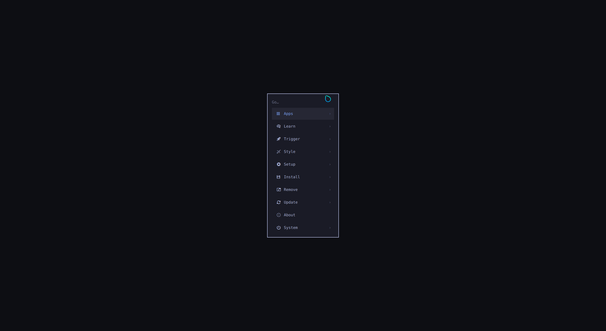
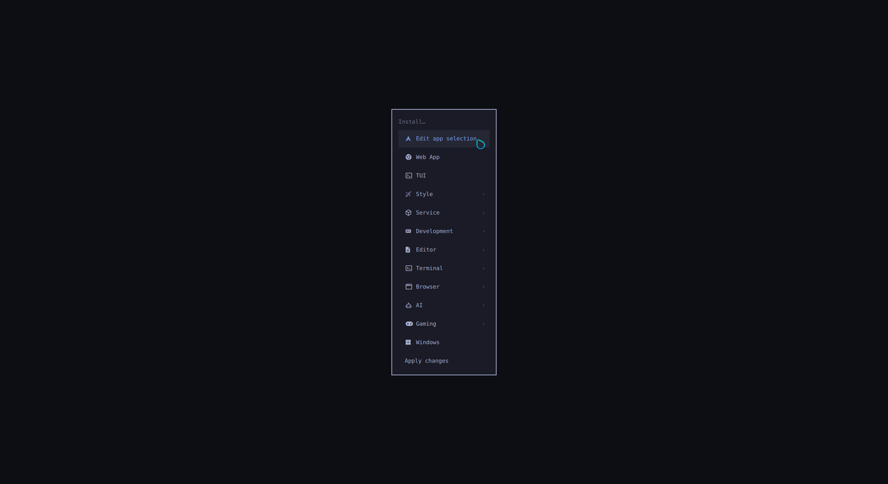
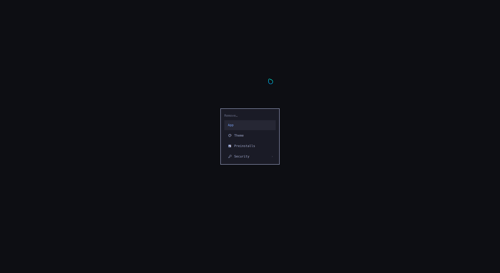
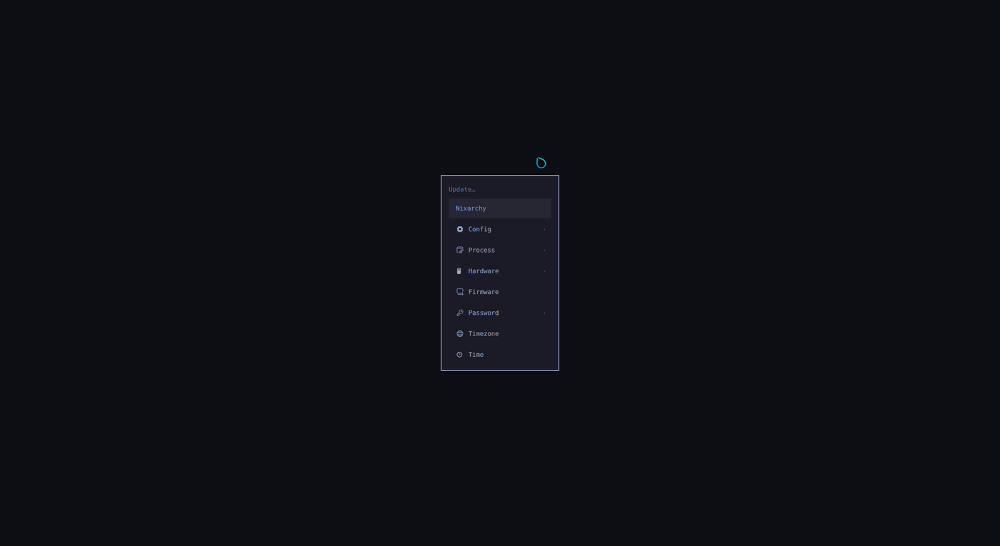

# nixarchy

[Omarchy](https://omarchy.org) vendored for NixOS — the whole desktop, with its
menus rewired to Nix instead of pacman.

Omarchy 4.x is not a dotfiles repo, it's an application: **438 shell commands**,
a QuickShell desktop shell, 22 themes, and Hyprland configured through the Lua
API introduced in 0.55. Nixarchy packages that tree as a derivation and replaces
the parts that assume Arch, rather than reimplementing it in Nix.

Tracking an upstream release is a source bump, not a re-port.


| the menu | Install |
|---|---|
|  |  |
| **Remove** | **Update** |
|  |  |

> The menu sits on black rather than on a dimmed desktop. That is a known bug,
> not the design — see [Known gaps](#status). The desktop above is what is
> actually behind it.

More in [`docs/screenshots/`](docs/screenshots).

## What works

| | |
|---|---|
| Hyprland session, QuickShell bar, 22 themes | as upstream ships them |
| `omarchy` CLI | all 429 subcommands |
| **Install menu** | picks write to a Nix config, not pacman |
| **Remove menu** | deselects apps, never touches your own config |
| **Update menu** | `nix flake update` + `nixos-rebuild switch --flake` |
| 37 apps from Omarchy's menu | 30 from nixpkgs, 5 as NixOS modules, 2 packaged here |
| Learn menu | NixOS wiki, `search.nixos.org` packages and options |

## Why vendoring

Everything upstream resolves through a single environment variable:

```lua
-- default/hypr/bootstrap.lua
package.path = home.."/.local/state/?.lua;"..home.."/.config/?.lua;"
  ..(os.getenv("OMARCHY_PATH") or "/usr/share/omarchy").."/?.lua;"
```

Point `OMARCHY_PATH` at a store path and the bins, the QML shell, the themes and
the Lua defaults all follow. Only **32 of 438 scripts** touch `pacman`/`yay` —
that's the entire distro-coupling surface.

## Installing apps

Omarchy's Install menu runs `pacman -S`. Here it edits a file you own.

Every app Omarchy offers is written to `~/.config/nixarchy/apps.nix` at first
login, fully populated and **entirely commented out**:

```nix
{
  programs.nixarchy.apps = {
    # ── Browser ───────────────────────────
    # brave.enable      = true;  #@ brave
    # firefox.enable    = true;  #@ firefox    # a NixOS module, so policies are declarative too
    # ── Service ───────────────────────────
    # tailscale.enable  = true;  #@ tailscale  # a daemon
    # _1password.enable = true;  #@ _1password # unfree — needs the module for its setuid helper
  };
}
```

Picking an app from the menu uncomments one line and tells you so. Pick as many
as you like — **nothing is built until you apply**, which is the point of a
declarative system:

```
Install ▸ Brave          →  "brave queued — not installed yet"
Install ▸ VSCode         →  "2 app(s) selected"
Install ▸ Apply changes  →  nixos-rebuild switch --flake
```

The notification is clickable and runs the rebuild.

### Why it isn't a package list

Several of these are **not packages** on NixOS, and a flat `systemPackages`
list would have been quietly wrong:

| app | what it actually needs |
|---|---|
| Steam | `programs.steam` — an FHS wrapper, or it will not run |
| 1Password | `programs._1password-gui` — a setuid helper, or it cannot unlock |
| Tailscale | `services.tailscale` — a daemon |
| Xbox controllers | `hardware.xpadneo` — a kernel driver |

`data/apps.nix` records which is which, and per-app `settings` merge at that
app's own option path:

```nix
programs.nixarchy.apps.tailscale = {
  enable = true;
  settings.useRoutingFeatures = "client";   # → services.tailscale.useRoutingFeatures
};
```

## Usage

```nix
{
  inputs.nixarchy.url = "github:olafkfreund/nixarchy";

  outputs = { nixpkgs, nixarchy, ... }: {
    nixosConfigurations.mymachine = nixpkgs.lib.nixosSystem {
      modules = [
        nixarchy.nixosModules.nixarchy
        {
          programs.nixarchy.enable = true;
          # Where nixarchy-apply copies your app selection before rebuilding.
          programs.nixarchy.flake = "/home/you/nixos-config";
        }
        ./nixarchy-apps.nix # the generated selection
      ];
    };
  };
}
```

And in Home Manager:

```nix
{
  imports = [ nixarchy.homeManagerModules.nixarchy ];
  programs.nixarchy.enable = true;
  programs.nixarchy.defaultTheme = "tokyo-night";
}
```

## Try it in a VM

```sh
# graphical -- this is the one that shows the desktop
QEMU_OPTS="-device virtio-vga-gl -display gtk,gl=on" \
  nix run github:olafkfreund/nixarchy#vm

# headless -- serial console, for reading the journal when the session is broken
QEMU_OPTS="-display none -serial mon:stdio" \
  nix run github:olafkfreund/nixarchy#vm
```

Autologs in as `omarchy` / `omarchy`, with sshd on `localhost:2222` so the VM
can be inspected and driven from the host.

**The VM's disk is ephemeral.** `nix run .#vm` otherwise writes a
`nixarchy-vm.qcow2` and reuses it forever, which makes a smoke test replay the
previous run's state — Omarchy persists every notification under
`~/.local/state/omarchy/notifications/history/` and replays it on start, so
fixed bugs kept reappearing from a stale disk.

## Screenshots

`docs/capture-screenshots.sh` captures every menu from a running VM. It has to
run against a **graphical** VM: with `-display none` nothing consumes the
compositor's frames, page flips never complete, and `grim` blocks forever.

```sh
ssh -p 2222 omarchy@localhost 'bash -s' < docs/capture-screenshots.sh
scp -P 2222 'omarchy@localhost:~/nixarchy-screenshots/*.png' docs/screenshots/
```

## Staying current with Omarchy

Almost nothing here waits on a maintainer.

**30 of the 37 apps never touch this repo.** Brave, VSCode, Steam, Signal and
the rest are installed as `pkgs.<name>` from **your** nixpkgs. Your own
`nix flake update` moves them. Nixarchy is not in that path, so there is
nobody to wait for.

**Omarchy itself is checked daily.** `omarchy.yml` asks GitHub for the newest
release, and if it differs from the pin it bumps the input and re-runs every
assertion against the new tree:

```
v4.0.0 -> v4.0.1
  ✓ the vendored tree builds
  ✓ every bin this port replaces is still there
  ✓ every substituteInPlace anchor still matches   (--replace-fail)
  ✓ every menu row it overrides still exists
  ✓ all 37 Install rows are still mapped in data/apps.nix
  ✓ a booted session renders its wallpaper   (delta 10, threshold 120)
```

Each line is a different way upstream can break this port, and each has caught
a real one. The last is the reason the others are not enough on their own: the
desktop once rendered pure black while every other check passed — a wallpaper
wider than `GL_MAX_TEXTURE_SIZE` draws nothing at all while Qt still reports
the image `Ready`. So the session test boots a machine, screenshots it through
qemu, and compares the screen's average colour to the wallpaper's own.

If they all pass, the bump merges itself. When one fails, the run summary
names which of them broke and which file to edit. **A new app in Omarchy's Install menu is usually one line** in
`data/apps.nix` — `attr` for a plain nixpkgs package, `option` for something
that needs a NixOS module. The menu rewiring and its Remove row are generated
from that entry.

## Keeping applications updated

Most of it is not our job, and should not be:

| where the app comes from | who updates it |
|---|---|
| nixpkgs (30 of 37 apps) | **nobody** — your own `nix flake update` |
| pinned in this repo (2) | a weekly bot, opening a PR |
| `zen` | upstream's own flake |

For the handful pinned here by version and hash, `.github/workflows/update.yml`
runs `nix run .#update` weekly, builds everything it changed, and opens a
PR. Those PRs are **not** auto-merged: a build proves a package assembles, not
that it still launches, and two of them are proprietary Electron bundles that
can do the first without the second.

Every app also exposes a `package` option, so a newer version is yours to take
without a fork or a PR:

```nix
programs.nixarchy.apps.once.package =
  nixarchy.packages.${system}.once.overrideAttrs (old: rec {
    version = "0.4.0";
    src = pkgs.fetchurl {
      url = "…";
      sha256 = "…";
    };
  });
```

## Design notes

Each of these is a bug that shipped, was found, and is now guarded by CI.

### The menu is data, and overrides destroy what they omit

Upstream reads one extension file and merges it over the defaults by id. Its
comment says you can *"tweak label/icon/action without re-declaring the whole
row"*. **The code does not do that:**

```js
label: value.label || id,                    // normalizeItem runs on the override too
icon:  value.icon  || "",
for (var k2 in entry) merged[k2] = entry[k2] // then copies ALL keys over the default
```

An override that omits a key does not inherit upstream's — it blanks it.
Omitting `label` renders the raw id (`install.editor.vscode` instead of
`VSCode`); omitting `action` makes the row do nothing when clicked. The menu
extension is therefore **generated by reading Omarchy's own menu** and carrying
every unstated key across, so labels can never drift from upstream's. CI
rejects a row with no label or no action.

The 16 per-app Remove rows are derived the same way: upstream names the app
only inside its `when`, as `omarchy-pkg-present <arch-package>`, so the
generator reads that and rewrites the row.

### Bins are symlinked, not wrapped

`bin/omarchy` discovers its subcommands by grepping the first 80 lines of each
sibling for `# omarchy:summary=`. A `wrapProgram`-generated wrapper has no such
comment, so wrapping every bin makes the CLI report **zero** commands while
still building fine. Runtime dependencies reach the scripts through the
module's `systemPackages` instead.

### Wallpapers are capped at 4096px

Omarchy ships wallpapers up to 7680px wide, and 5 of the 8 in the default theme
exceed 4096 — `GL_MAX_TEXTURE_SIZE` on llvmpipe and on plenty of integrated
GPUs. Over that limit the image cannot become a texture and **nothing is drawn,
with no error anywhere**: Qt reports the image `Ready` at its full size, the
layer surface exists at alpha 1, and the log is clean. `sourceSize` caps what
Qt decodes, which fixes it on every machine with that limit.

### User state stays mutable

`omarchy-theme-set` applies themes at runtime by copying files into
`~/.local/state/omarchy/current/` and flipping symlinks. That's anti-Nix, and
it's also why theme switching is instant instead of a rebuild.

- **Nix owns** packages, services, hardware, `OMARCHY_PATH`, the default theme
- **Omarchy owns** `~/.local/state/omarchy` and `~/.config/omarchy` at runtime

Those are copied with `--no-preserve=mode`: `$OMARCHY_THEMES_PATH` is a store
path, so `cp -r` otherwise stages a read-only directory and the *next* theme
switch cannot clean it up.

### Hyprland comes from upstream, not nixpkgs

Omarchy 4.x needs ≥ 0.55 for `hl.bind` / `hl.window_rule` / `hl.on`; nixpkgs is
on 0.54.3.

The flake pins a **commit**, not the `v0.56.2` tag, because that tag does not
build against its own `flake.lock`: its `CMakeLists.txt` asks for
`find_package(glaze 7...<8)` while `nix/overlays.nix` feeds it the glaze 8.0.0
from its locked nixpkgs. `find_package` fails, CMake falls back to cloning glaze
over the network, and the build sandbox has none.

`inputs.nixpkgs.follows` is deliberately **not** set on it — hyprwm asks
consumers not to, and overriding forfeits their binary cache.

## Development

```sh
nix develop                  # or `direnv allow`
nix build .#omarchy          # fast -- just the vendored tree
nix flake check              # everything, including a booted session test
nix run .#vm                 # smoke test
nix run .#update         # bump the pinned packages
```

`checks.session` boots a machine, picks two apps through `nixarchy-app-enable`,
checks the file still parses, checks a repeated pick is a no-op, and checks
`nixarchy-apply` copies the selection into the flake.

## Status

Working: the session, the bar, themes, the CLI, the Install, Remove and Update
menus, and the app selection loop end to end.

Known gaps:

- `brave-origin` has no published source; use `apps.brave` with policies in
  `/etc/brave/policies/managed`
- UPower is not enabled, so the battery widget is inert
- Bluetooth's DBus object manager fails in the VM
- Opening the menu blanks everything beneath it -- wallpaper *and* bar. The
  menu's own surface is `color: "transparent"` and its scrim is the background
  at alpha 0.5, but changing that alpha to 0.12 makes no difference to the
  rendered pixel, so the compositor is not blending under the fullscreen
  overlay layer at all. Not yet traced; it may be specific to software
  rendering.

## License

Packaging is MIT. Vendored Omarchy is MIT, © Basecamp.
